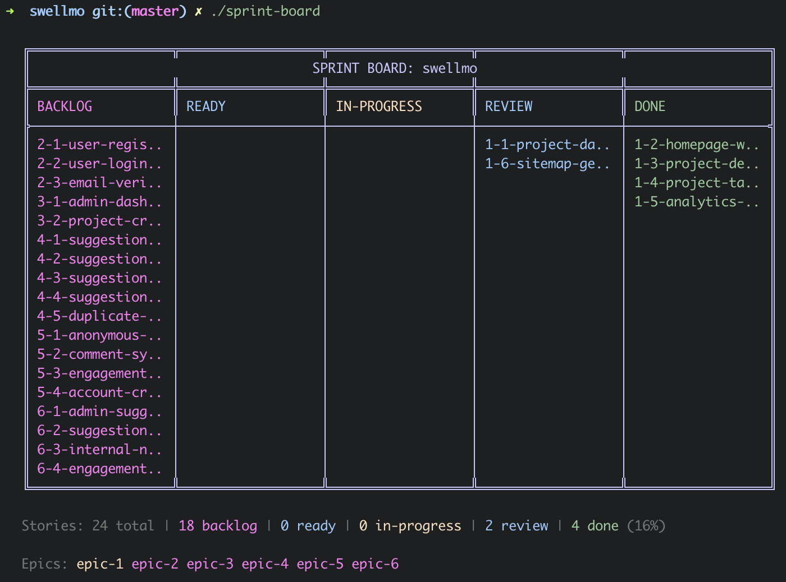
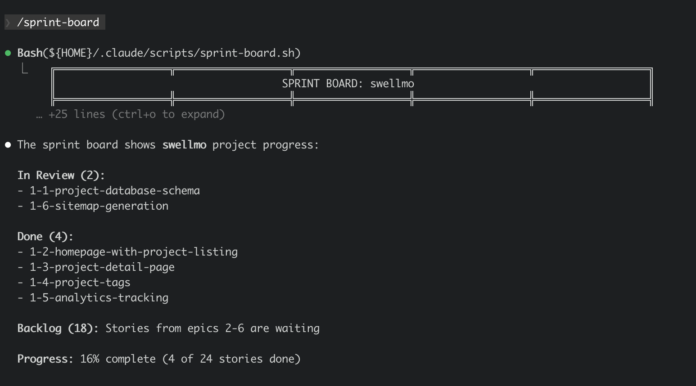
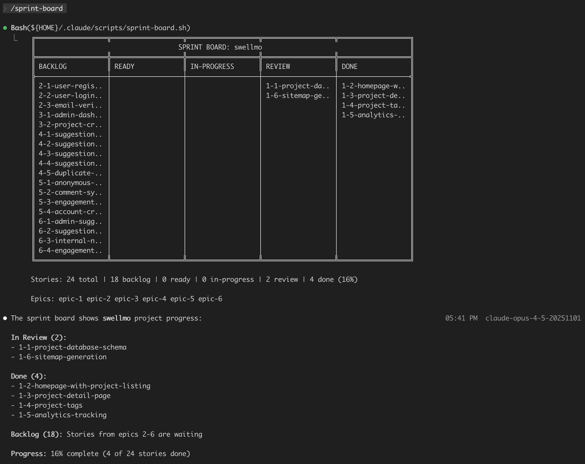

# Sprint Board

Visual Kanban board for BMAD sprint status in Claude Code.



## Quick Install

```bash
curl -fsSL https://raw.githubusercontent.com/thibaultspriet/bmad-sprint-board/master/install.sh | bash
```

The installer will prompt you to choose:
- **Global** or **Project** installation mode
- **Terminal shortcut**: Creates `./sprint-board` in your project for direct terminal access

## Requirements

- **bash 3.2+** (macOS default, Linux, Windows via WSL)
- **Claude Code CLI** (to use the `/sprint-board` command)
- **BMAD** installed in your project with:
  - `_bmad/_memory/config.yaml` (with `output_folder` defined)
  - `{output_folder}/implementation-artifacts/sprint-status.yaml`

## Installation Modes

### Global Installation

- Files installed to `~/.claude/scripts/` and `~/.claude/commands/`
- The `/sprint-board` command is available in Claude Code from **any directory**
- **However**, the script still requires BMAD to be present in the **current project**
- Use this if you work on multiple BMAD projects

### Project Installation

- Files installed to `./.claude/scripts/` and `./.claude/commands/`
- The `/sprint-board` command is only available in **this project**
- Use this if you want to keep the tool isolated to one project

## Usage

### In Claude Code

```
/sprint-board
```

The output is truncated by default. Press `Ctrl+O` to expand:



After expanding with `Ctrl+O`:



### In Terminal (recommended for full display)

If you created the terminal shortcut during installation:

```bash
./sprint-board
```

Running directly in the terminal shows the full board with colors, without truncation.


## Windows Support

### WSL (Recommended)

Sprint Board is fully supported on Windows via WSL (Windows Subsystem for Linux):

1. Open WSL terminal
2. Navigate to your project
3. Run the install command

### Git Bash

Git Bash is supported. The installer automatically creates a wrapper script instead of a symlink for compatibility.

## Configuration

Environment variables to customize the display:

| Variable | Description | Default |
|----------|-------------|---------|
| `NO_COLOR=1` | Disable ANSI colors | colors enabled |
| `SPRINT_BOARD_ASCII=1` | Use ASCII instead of Unicode box characters | Unicode |
| `SPRINT_BOARD_COL_WIDTH=N` | Set column width in characters | 18 |

Example:
```bash
SPRINT_BOARD_COL_WIDTH=25 ./sprint-board
```

## Uninstall

### Global Installation

```bash
rm ~/.claude/scripts/sprint-board.sh
rm ~/.claude/commands/sprint-board.md
rm ./sprint-board  # if shortcut was created
```

### Project Installation

```bash
rm ./.claude/scripts/sprint-board.sh
rm ./.claude/commands/sprint-board.md
rm ./sprint-board  # if shortcut was created
```

## How It Works

1. The script searches for `_bmad/_memory/config.yaml` starting from the current directory
2. It reads the `output_folder` setting from the config
3. It parses `sprint-status.yaml` from `{output_folder}/implementation-artifacts/`
4. It renders stories in a Kanban board format grouped by status

## License

MIT License - see [LICENSE](LICENSE) for details.
